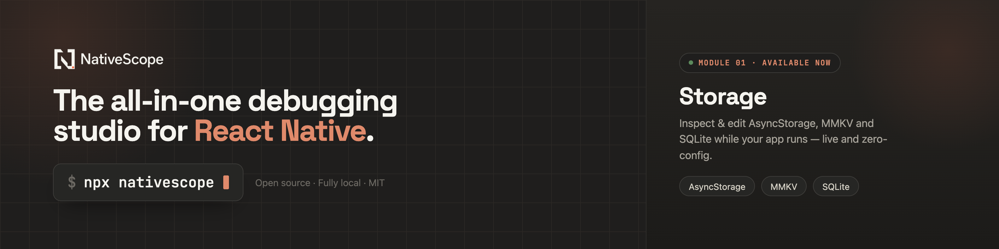

<p align="center">
  
</p>

# NativeScope

**A fully local debugging environment for React Native.**

NativeScope is being built as a plug-and-play debug environment for React Native teams: one local Studio, one simple install, and modules that help you understand what is happening inside your app without accounts, cloud sync, or heavy setup.

Two modules ship today:

- **Storage** discovers AsyncStorage, MMKV, expo-sqlite, and op-sqlite while the app is running, then gives you a professional interface to inspect, edit, diff, restore, and reason about real app data.
- **Network** captures HTTP and GraphQL operations in one timeline, with structured payload inspection, filters, capture sessions, replay, performance insights, and automatic links to the storage changed by each response.

No account. No cloud. No provider. No root wrapper. Your development data stays on your machine.

```bash
npm install --save-dev react-native-nativescope
npx nativescope
```

NativeScope composes your Metro config in development, opens the local Studio, and gets out of the way for release builds.

## Why NativeScope

- **One environment, growing by modules**: Storage and Network share the same local Studio, transport, and configuration.
- **Zero-friction storage discovery** for AsyncStorage, MMKV, expo-sqlite, and op-sqlite.
- **Bidirectional editing** so Studio changes can update the running app.
- **Visual JSON navigation** for nested objects, arrays, inline edits, and TypeScript shape export.
- **SQLite table tooling** with tabs, sorting, selection, inline edits, inserts, bulk delete, and SQL execution.
- **Snapshots and diff** to freeze storage, compare later, highlight changes, and restore safely.
- **HTTP and GraphQL inspection** with structured replay, session insights, sound rules, and storage impact.
- **Local-first by design** over `127.0.0.1`, with no login, telemetry, or hosted data path.

## Quickstart

Install it as a dev dependency and run it instead of Metro:

```bash
npm install --save-dev react-native-nativescope
npx nativescope
```

Then open your app. When it connects, the Storage module appears in the Studio with every detected provider.

Enable Network in the same optional root configuration file:

```ts
// nativescope.config.ts
import { defineNativeScopeConfig } from "react-native-nativescope/app";

export default defineNativeScopeConfig({
  modules: {
    network: true,
  },
});
```

## Optional app reactivity

Storage discovery and editing work without app code. Add a root config file only when you want app screens to react immediately after Studio-originated edits, for example when a value is cached by React Query.

```ts
// nativescope.config.ts
import { defineNativeScopeConfig } from "react-native-nativescope/app";

export default defineNativeScopeConfig({
  modules: {
    network: true,
    storage: {
      reactQuery: true,
      indicator: true,
    },
  },
});
```

`network: true` enables HTTP and GraphQL capture. `reactQuery: true` discovers QueryClient instances automatically and invalidates them only for Studio-originated changes. `indicator: true` shows a small in-app confirmation when storage is updated from the Studio. Every option is development-only.

## Repository

| Path                | Purpose                                                     |
| ------------------- | ----------------------------------------------------------- |
| `apps/cli`          | Public npm package, local server, Metro resolver, and shims |
| `apps/desktop`      | Browser-based NativeScope Studio                            |
| `apps/playground`   | Expo integration and release-bundle fixture                 |
| `apps/site`         | Landing page, documentation, journal, and comparison pages  |
| `packages/protocol` | Versioned wire schemas and payload budgets                  |
| `packages/runtime`  | On-device registry, adapters, streams, and transport        |
| `packages/testkit`  | Contract, scale-budget, and adapter fixtures                |

## Development

```bash
pnpm install --frozen-lockfile
pnpm -r typecheck
pnpm -r test
pnpm --filter react-native-nativescope build
node apps/cli/dist/cli.mjs --fake --no-open
```

The public package embeds the compiled Studio in `apps/cli/dist/ui`. CI verifies the npm tarball, clean consumer install, CLI entrypoint, bundled Studio, package boundaries, and release-bundle safety.

## Documentation

Read the docs, engineering notes, and comparisons at [nativescope.dev](https://nativescope.dev).

## License

[MIT](LICENSE)
